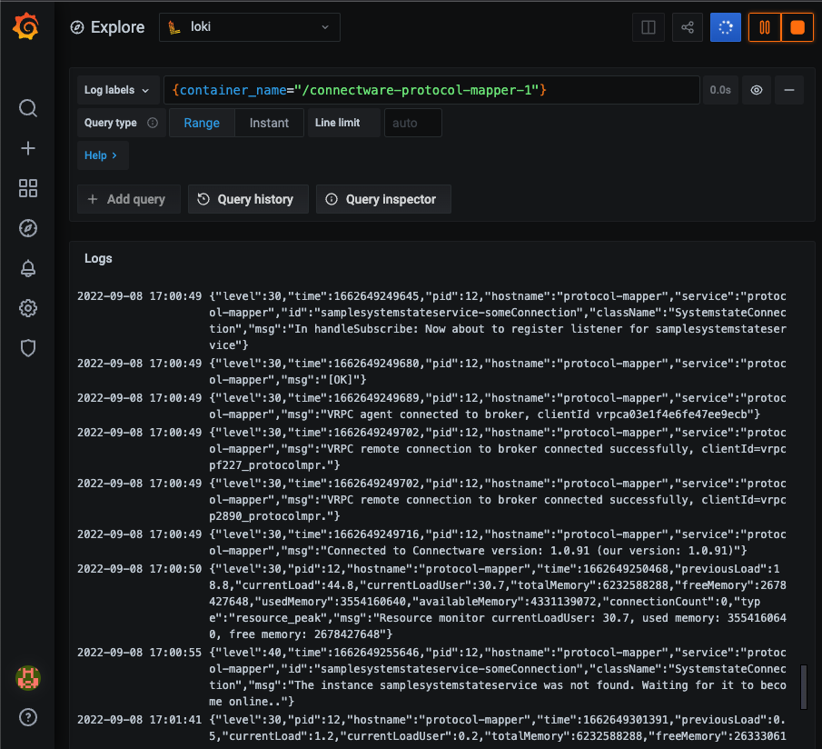

# How to use Connectware with Fluent Bit and Grafana Loki

This is an example how to configure a Connectware Docker composition
for use with Fluent Bit log shipping to a Grafana Loki instance.

## Objective

The goal is to replace a default per-container json logging with a fast and easy log aggregation
for Cybus Connectware with low impact on processing, forwarding, visualization and setup effort,
so that logs can be easier processed (analyzed, correlated, stored).

## Shortcut with stdout

To simply stream the container logs out of the composition:
- first change the Docker log driver to `fluentd`,
- then start a fluent-bit instance like below and
- finally start the Connectware Docker composition.

> ℹ️ Make sure to use a valid Connectware License key in the `.env` file.

```bash
docker run --rm -p 24224:24224 --name fluent-bit \
  fluent/fluent-bit:3.1.4 /fluent-bit/bin/fluent-bit \
  -i forward -o stdout -p format=json_lines -f 1
```

The result will be a continuous log stream of all Connectware containers,
each identifying the log origin and embedding the actual log payload:
```
...
{ "date":1723187314.986692,
  "container_id":"970eacd5cd9a6b5020967311cabe1a7e14cc8e0261111ddabae5102231e2a8ef",
  "container_name":"/connectware-service-manager-1",
  "source":"stdout",
  "log":"{\"level\":30,\"time\":1723187314986,\"pid\":17,\"hostname\":\"service-manager\",\"id\":\"simplemapping\",\"className\":\"Service\",\"msg\":\"Successfully registered ResourceStateListener state listener at agent protocol-mapper\"}"
}
....
```


### Reconfigure a Connectware docker container

The default logging driver used with the Connectware Docker composition is `json-file`
due to some insights about most useful default medium requirements.
It's up to the Connectware operator to change this for other requirements.

This is configured on per-container basis like this:
```
  logging:
    driver: json-file
    options:
      max-file: "2"
      max-size: 10m
```

Every container can be configured individually for logging, so that the user can decide,
which logs should reach the configured container.

The above log configuration can be replaced with the fluentd variant:
```
  logging:
    driver: fluentd
    options:
      fluentd-address: localhost:24224
      fluentd-async: "true"
      fluentd-sub-second-precision: "true"
```

Start the Connectware with one or more of these replacements
and see the log output of the running fluent-bit container.


## Centralized Log configuration in Connectware

To simplify the log configuration, a user can utilize:
- extension fields in docker compositions (since version 3.4, [Docker Compose Extension Fields](https://docs.docker.com/compose/compose-file/compose-file-v3/#extension-fields))
- Yaml anchors and aliases together with the merge key

Doing so, the shrink percentage of the Connectware docker composition is ~13%.


> ℹ️ Use the script `./connectware/recompose-connectware-docker-composition.sh`
to convert a given Connectware docker-composition for centralized
logging with a logging configuration of a user's choice.

### Extension fields for centralized logging

The extension field is marked with an anchor `logging`:
```
x-logging: &logging
  logging:
    driver: fluentd
    options:
      fluentd-address: "localhost:24224"
      fluentd-async: "true"
      fluentd-sub-second-precision: "true"
...      
```

Now every service specific logging object in the compose file can be replaced like this:
```
...
services:
  admin-web-app:
...
    image: registry.cybus.io/cybus/admin-web-app:1.7.2
    labels:
    - io.cybus.connectware=core
    <<: *logging
...
  auth-server:
...
    image: registry.cybus.io/cybus/auth-server:1.7.2
    labels:
    - io.cybus.connectware=core
    <<: *logging
...
```

Start the Connectware with the complete replacement
and see all Connectware logs in the running fluent-bit container.


## Forward logs to Grafana Loki using Fluent Bit

### Quickstart

Using the docker compositions in this project starts the solution with a few lines:

- Start the log aggregation and shipping with a Grafana Loki UI (if required provide an `.env` define overrides for the Grafana or Loki port settings):
```bash
docker compose -f docker-compose-grafana-loki.yml up -d
docker compose -f docker-compose-fluentbit.yml up -d
```

- Then start a pre-configured and recomposed connectware for this fluent-bit container
as described above, e.g. [docker-compose_fluentd-logging.yml](./connectware/docker-compose_fluentd-logging.yml).
- Then open a browser window and visit directly the explore view on [Grafana Loki - Connectware Protocol-Mapper logs](http://localhost:3000/explore?schemaVersion=1&panes=%7B%22rmg%22%3A%7B%22datasource%22%3A%22P982945308D3682D1%22%2C%22queries%22%3A%5B%7B%22refId%22%3A%22A%22%2C%22expr%22%3A%22%7Bcontainer_name%3D%5C%22%2Fconnectware-protocol-mapper-1%5C%22%7D+%7C%3D+%60%60%22%2C%22queryType%22%3A%22range%22%2C%22datasource%22%3A%7B%22type%22%3A%22loki%22%2C%22uid%22%3A%22P982945308D3682D1%22%7D%2C%22editorMode%22%3A%22code%22%7D%5D%2C%22range%22%3A%7B%22from%22%3A%22now-1h%22%2C%22to%22%3A%22now%22%7D%7D%7D&orgId=1)

Use the query builder to select label filters for other containers.

Example for the protocol-mapper logs.


### Details

To forward the logs to one or many higher-level tools ([Fluent Bit Outputs](https://docs.fluentbit.io/manual/pipeline/outputs))
like Loki, Elasticsearch, Kafka, InfluxDB and others, the operator needs to configure fluent-bit accordingly.

In this example we focus on a lightweight approach with a Grafana Loki instance
as some docker composition alongside the running Connectware.

See the [Grafana Loki composition](./docker-compose-grafana-loki.yml) for an example
how to provide a simple output endpoint for Fluent Bit.

A local configuration [loki.yml sample](./configs/loki/loki.yaml) shows some basic
settings to work with. For production use like for a useful retention period etc.
follow the [Loki configuration docs](https://grafana.com/docs/loki/latest/configuration/).

Grafana is set up for [Loki as a data source](./configs/grafana/datasource.yaml) 
without further settings

Finally, the [Fluent Bit composition](./docker-compose-fluentbit.yml) uses a
Grafana Fluent Bit container image with the Loki output plugin pre-installed
with a [simplified configuration sample](./configs/fluentbit/fluent-bit.conf) 
to connect to Loki.

## Handling logs with Fluent Bit

Operators could still keep the `json-file` logging and parse the json file logs into
their log shipping tool, which can also be lightweight Fluent Bit with its flexibility.

Using the Fluentd logging driver with a separate Fluent Bit service combines the
benefits of centralized log processing with the lightweight nature of Fluent Bit.
This setup provides flexibility, performance, and ease of management, making it
suitable for modern containerized environments where efficient log management is crucial.

### Efficiency considerations

When considering the efficiency of Fluent Bit in handling logs, there are
a few factors to consider, particularly in the context of parsing JSON file
logs versus receiving logs directly from the Fluentd logging driver.

Let's examine these two methods in terms of performance, resource usage,
and complexity.

#### 1. Parsing JSON File Logs

How It Works:
- **Log Files**: Logs are written to JSON-formatted files on the host or within containers.
- **Fluent Bit**: Fluent Bit tails these log files, parses the JSON entries, and processes them for filtering or forwarding.

Advantages:
- **Simplicity**: Reading from log files is straightforward and doesn’t require configuring the Docker daemon for log forwarding.
- **Decoupling**: This method decouples log collection from the Docker runtime, which can be beneficial for system stability and flexibility.
- **Compatibility**: JSON is a standard log format, which Fluent Bit can easily parse and handle.

Considerations:
- **Disk I/O**: Frequent writes and reads from log files can result in high disk I/O, potentially impacting performance on systems with limited resources.
- **Log Rotation**: Proper log rotation and management must be in place to prevent excessive disk usage and ensure logs are not lost.
- **Latency**: There may be a slight delay between when logs are written and when they are read and processed by Fluent Bit, depending on the tailing configuration.

#### 2. Getting Logs from the Fluentd Logging Driver

How It Works:
- **Fluentd Logging Driver**: Docker is configured to use the Fluentd logging driver to forward logs directly to Fluent Bit.
- **Network Transfer**: Logs are sent over the network or a local socket directly to Fluent Bit for processing.

Advantages:
- **Real-Time Processing**: Logs are forwarded in real-time as they are generated, reducing latency in log processing.
- **No Disk Usage**: Logs are transferred directly, avoiding additional disk I/O from writing to and reading from files.
- **Centralized Configuration**: Log forwarding is configured at the Docker daemon level, simplifying container log management.

Considerations:
- **Configuration Complexity**: Requires configuring Docker with the Fluentd logging driver, which may involve changes to daemon settings and restarting services.
- **Network Overhead**: Depending on the setup, network overhead might be a consideration, though this is typically minimal when using local sockets.
- **Dependency**: Introduces a dependency on the Fluent Bit service being available for logging, which means if Fluent Bit is down, logs may not be collected unless fallbacks are implemented.

#### Conclusion

- **Performance**: The Fluentd logging driver approach is generally more efficient in terms of reducing disk I/O, as it avoids writing logs to disk entirely. This can lead to better performance, especially in high-throughput environments.
- **Resource Usage**: Using the Fluentd logging driver is often more resource-efficient because it eliminates the need for additional disk operations and can use lightweight network communication instead.
- **Complexity and Reliability**: Parsing JSON logs from files is simpler to set up and may offer more reliability in environments where network communication could be unstable.

#### Recommendations
- High-Throughput Environments: For environments with high log volumes, using the Fluentd logging driver to send logs directly to Fluent Bit can be more efficient and reduce latency.
- Resource-Constrained Systems: If disk I/O is a bottleneck or if you want to minimize disk usage, using the Fluentd logging driver is preferable.
- Simplicity and Compatibility: If ease of setup and compatibility with existing logging infrastructure are priorities, parsing JSON file logs might be more appropriate.

> Ultimately, the choice between parsing JSON file logs and using the Fluentd logging driverq
should be based on the specific requirements and constraints of your environment.
If performance and real-time log processing are critical, and you can handle the additional
configuration complexity, using the Fluentd logging driver with Fluent Bit is likely the more efficient option.


## Next steps

### Fluent Bit

The Fluent Bit instance can be easily configured for further/parallel outputs
and more complex configuration e.g. for more useful labels (see the corresponding documentation).

The CPU and memory footprint is pretty small, so further measures to tweak the setup
for production use may be just need for massive load and constraints in the environment.

### Loki

Loki as the log aggregator has many options to work with, especially a retention
period will be for useful for stable production use. Whether the storage needs
more attention or not, will depend on the operational requirements.

### Grafana

Grafana as a widely used frontend is useful for many aspects. 
The typical log queries for correlation between the different containers
are proper for debugging and QA.

Grafana as the UI for an observability platform can be enriched with further data sources
for monitoring and metrics, alerts and not least for graphical visualization.

## References

- [Cybus Connectware](https://cybus.io)
- [Fluent Bit](https://fluentbit.io)
- [Fluent Bit Logging pipeline](https://docs.fluentbit.io/manual/local-testing/logging-pipeline)
- [Docker logging drivers](https://docs.docker.com/config/containers/logging/configure/#supported-logging-drivers)
- [Docker Compose Extension Fields](https://docs.docker.com/compose/compose-file/compose-file-v3/#extension-fields)
- [Grafana Loki](https://grafana.com/oss/loki)
- [Fluent Bit Outputs](https://docs.fluentbit.io/manual/pipeline/outputs)
- [Fluentd vs Fluent Bit](https://logz.io/blog/fluentd-vs-fluent-bit/)
